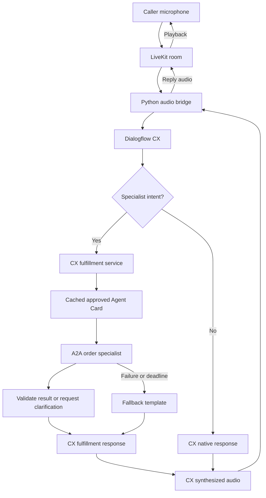
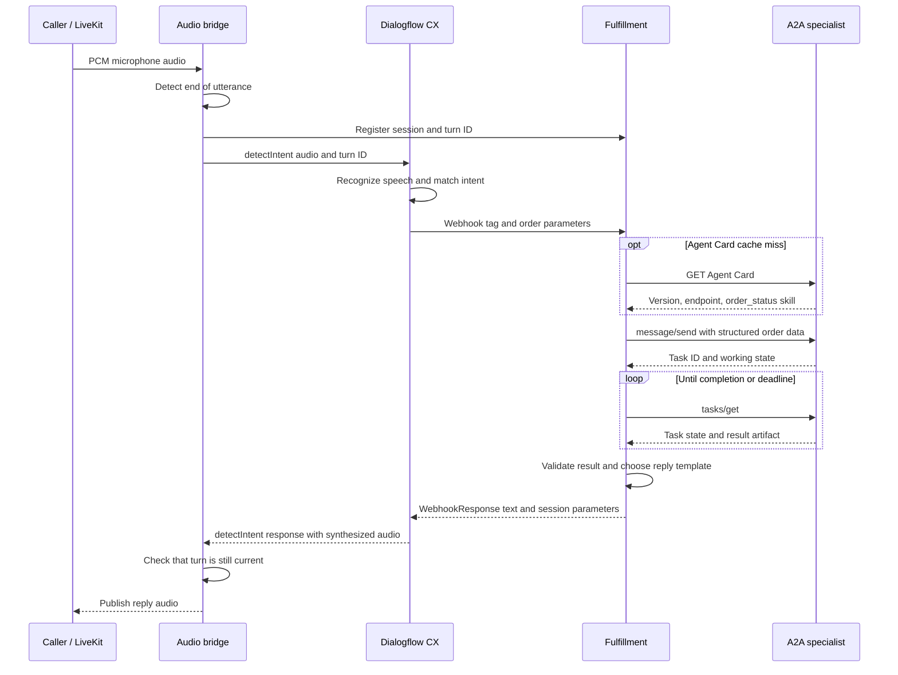
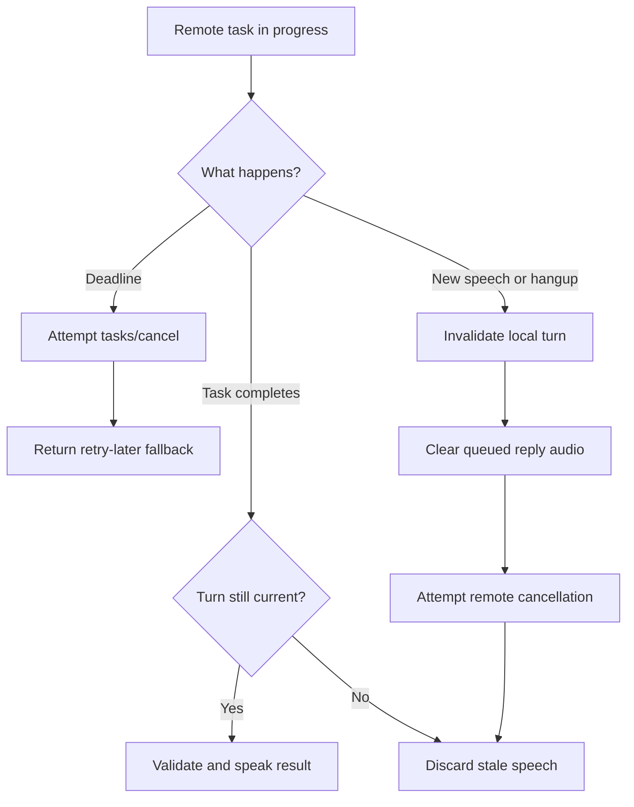

# Architecture and call flow

## Integration decision

Put the A2A client in the CX fulfillment service for this reference. CX already owns the conversation and decides when the `order_status` capability is needed. The LiveKit process transports audio and handles interruption; it does not make a second intent-routing decision.

An existing LiveKit + CX system can reuse the fulfillment service without replacing its current audio bridge. Add or update a CX webhook fulfillment route and map the existing order parameter to `order_id`. The optional audio bridge in this package is a standalone demonstration because the existing application's repository was not supplied.

This design needs a local fulfillment HTTP service and a specialist HTTP service. An existing fulfillment deployment could host the client adapter later. The earlier assumption that integration necessarily requires no new service or no CX configuration change is not valid for every installation.

## Component flow

Open [the standalone flow SVG](../diagrams/voice-flow.svg) or [sequence SVG](../diagrams/voice-sequence.svg) in a browser if your Markdown viewer does not render Mermaid. PNG copies and four editable `.mmd` sources are also in `diagrams/`.



The `demo` and `chat` commands enter at the fulfillment service using simulated CX JSON. Only `cx-text` and `voice` call Google. The local specialist always uses fictitious records in all modes.

## Successful voice turn



Audio formats are mono PCM16: 16 kHz to CX and 24 kHz from CX. LiveKit transports encoded real-time media; the RTC SDK exposes PCM frames to the Python bridge. This demo buffers each utterance before `detectIntent`, so its latency includes endpoint detection and upload time. It does not implement streaming CX recognition.

## Clarification on the same A2A task

```mermaid
sequenceDiagram
    participant Call as Caller
    participant CX as CX / audio bridge
    participant Fulfill as Fulfillment
    participant Agent as A2A specialist
    Call->>CX: Check order ORD-2001
    CX->>Fulfill: order_id = ORD-2001
    Fulfill->>Agent: message/send
    Agent-->>Fulfill: input-required; missing_field = region
    Fulfill->>Fulfill: Save task ID, context ID, and order data
    Fulfill-->>CX: Ask east or west
    CX-->>Call: Spoken clarification
    Call->>CX: East
    CX->>Fulfill: region = east in the same CX session
    Fulfill->>Agent: message/send with saved taskId and contextId
    Agent-->>Fulfill: working, then completed via polling
    Fulfill-->>CX: Validated order status
    CX-->>Call: Spoken result
```

The fulfillment service remembers task continuation for up to five idle minutes. It does not trust incoming `a2a_task_id` parameters as authorization. A service restart loses this state; persistent storage is required for a scaled deployment.

## Deadline, interruption, and hangup



A cancellation request is best effort across services. It does not undo a completed operation. This is one reason the demonstration uses a read-only lookup. The local specialist acknowledges cancellation and prevents a canceled worker from publishing a later completed state.

The bridge registers a turn before calling CX, forwards its identifier through `query_params.payload`, and cancels that identifier when speech interrupts it. A late webhook for a canceled registered turn returns no speech. Calls to CX remain serialized because CX sessions are stateful; interrupting playback does not roll back an earlier CX page transition.

## Where this fits in an existing system

| Existing component | Integration action |
|---|---|
| LiveKit room/SIP transport | Keep the current transport for the existing application; the packaged microphone client demonstrates a room call without SIP |
| Existing CX audio client | Keep it; add the optional turn-control calls if lifecycle cancellation is required |
| CX intent and parameters | Reuse the existing order intent; map its parameters and enable a webhook tag |
| CX fulfillment | Host or call the new adapter; configure webhook authentication and failure handling |
| Specialist backend | Provide an approved A2A endpoint, business schema, authentication, and latency agreement |
| Existing CRM REST API only | A direct REST adapter may be the better choice unless agent interoperability is a real requirement |

Calling A2A from an existing LiveKit `function_tool` is another placement option when that worker already owns routing. It is not necessary in this implementation, and adding a second LLM router solely for A2A would complicate session ownership.
